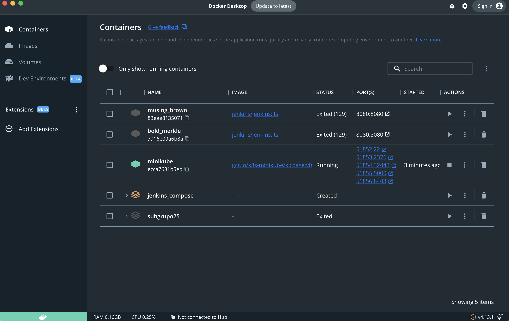
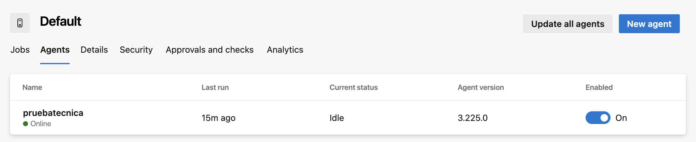

# Prueba Técnica - Reynaldo Leal

## Descripción
En esta prueba técnica desarrollare cada uno de los puntos requeridos y demostrare las diferentes habilidades que se solicitan para el desarrollo de la prueba tecnica.

## Parte 1: Infraestructura como Código (IaC) en Kubernetes.
Instrucciones:
1.	Desplegar un clúster de Kubernetes en Minikube, EKS, AKS o el servicio de kubernetes de su preferencia (se recomienda minikube ya que puede ser local.)
2.	Crear un pipeline en Azure DevOps para realizar la ejecución de esta IaC.


------
## Solucion 1
Ya poseo con anterioridad en mi terminal `minikube` `kubectl`

- Iniciar Minikube


- Verificar nodos





## Solucion 2

- Ahora tomando como principio el Minikube del primer punto.

Lo que hago es desde mi local crear un agente Auto hospedado en AzureDevOps.
* Se instala el agente en el local
* Se configura el agente
* Se debe crear un Personal Access Token

Funcionalmente debe verse de la siguiente manera.

- Agente


- Agente local esperando tipo Socket


- Ejecucion de pipeline


- Verificacion


Los archivos requeridos para realizar el despliegue, son la definicion de la aplicacion  y el archivo principal yml que lo va a desencadenar.

`service.yml`

```yml
apiVersion: v1
kind: Service
metadata:
  name: app-pruebatecnica-service
spec:
  selector:
    app: app-pruebatecnica
  ports:
    - protocol: TCP
      port: 80
      targetPort: 80
  type: NodePort

```

`deployment.yml`

```yml

apiVersion: apps/v1
kind: Deployment
metadata:
  name: app-pruebatecnica
spec:
  replicas: 2
  selector:
    matchLabels:
      app: app-pruebatecnica
  template:
    metadata:
      labels:
        app: app-pruebatecnica
    spec:
      containers:
        - name: app-pruebatecnica
          image: nginx:latest
          ports:
            - containerPort: 80

```

`azure-pipelines.yml`

```yml

trigger:
  - main
  - develop

pool:
  name: Default

steps:
  - checkout: self

  - script: |
      echo "Directorio actual:"
      pwd
      echo "Archivos en la carpeta actual:"
      ls -lR
    displayName: 'Verificar estructura de archivos en el agente prueba tecnica'

  - script: |
      cd $(Build.SourcesDirectory)/pipelines
      kubectl apply -f deployment.yaml
      kubectl apply -f service.yaml
    displayName: 'Desplegar en Minikube'

```

## Parte 2: CI/CD en Azure DevOps
Instrucciones:
1.	Crear una aplicación web básica que muestre el mensaje “hola mundo”, esta aplicación se debe versionar en algún repositorio de código. 

2.	Crear un pipeline en Azure DevOps que realice las siguientes acciones:
o	Ejecutar etapa de construcción, pruebas unitarias y sonar(cloud o qube).
o	Construya y etiquete una imagen Docker con la aplicación.
o	Suba la imagen a un container registry (ACR , ECR o Docker Hub).
o	Despliegue la aplicación en su entorno de docker utilizando kubectl apply.
o	Realice pruebas de conectividad (curl) al servicio.
o	Utilizar la metodología de shared libraries para las plantillas del pipeline (estas deben estar en un repo aparte).

-------

## Solucion 1
Cree una aplicacion en NodeJS con Express, por la facilidad de compilacion, lo rapido y el manejo de las pruebas unitaras con jest.

* Archivo Index


* Archivo Route


Una vez compilada, se ve de la siguiente manera en el navegador


Compilacion de pruebas unitarias locales con jest


## Solucion 2
Crear un pipeline en Azure DevOps que realice las siguientes acciones:

2.0


2.1 Se crea un pipeline separado por stage donde se hace la construccion de todas las demas plantillas


2.2 Subimos las imagenes a DockerHub

Ejecutando el siguiente fragmento se construye y carga en DockerHub por pipeline

```yml
jobs:
  - job: BuildAndPush
    displayName: 'Build Docker'
    pool:
      name: Default

    steps:
      - task: Docker@2
        inputs:
          command: 'buildAndPush'
          containerRegistry: 'DockerHub'
          repository: 'reynaldoreyes204/pruebatecnica'
          tags: 'latest,$(Build.BuildId)'
```

2.3 


2.4 Se realizan pruebas obteniendo el Cluster-info, dinamicamente obteniendo la URL y usando la misma


2.5 Se implemento un repositorio que carga las plantillas de template


2.6 Donde se copia el repositorio y se invoca cada pipeline por cada paso requerido


```yml
trigger:
  branches:
    include:
      - develop
      - main
      - master

resources:
  repositories:
    - repository: pipelines-templates
      type: git
      name: concepto/pipelines-templates
      ref: refs/heads/main

stages:
  - stage: Build
    displayName: 'Build'
    jobs:
      - template: templates/build.yml@pipelines-templates

  - stage: TestAndSonar
    displayName: 'Test'
    dependsOn: Build
    jobs:
      - template: templates/test-sonar.yml@pipelines-templates 

  - stage: Docker
    displayName: 'Construcción Docker'
    dependsOn: TestAndSonar
    jobs:
      - template: templates/docker.yml@pipelines-templates

  - stage: Deploy
    displayName: 'Deploy'
    dependsOn: Docker
    jobs:
      - template: templates/deploy.yml@pipelines-templates
        parameters:
          kubernetesConfig: 'kubernetes/deployment.yaml'

```

El codigo de template estara disponible en el GitHub sobre la carpeta pipelines-template

## Parte 3: Versionamiento y GitOps
Instrucciones:
1.	Implementar versionamiento semántico en el repositorio con etiquetas (v1.0.0, v1.1.0, etc.).
2.	Implementar una rama de desarrollo (develop) y una de producción (master), siguiendo buenas prácticas de Git Flow.
3.	Diseñar diagrama del Git Flow implementado.

## Solucion 1

1. implementacion de versionamiento semantico basado en un parametro para versionar a libertad o versionamiento en patch al llegar  a una rama main sin versionamiento por parametro

```yml
parameters:
  versionType: 'major'
```

```yml
      - script: |
          BRANCH_NAME=$(echo $BUILD_SOURCEBRANCH | sed 's|refs/heads/||')

          if [ "$BRANCH_NAME" != "main" ]; then
            echo "No estamos en 'main', no se generará un tag."
            exit 0
          fi

          echo "Estamos en la rama main, generando tag..."

          VERSION=$(git describe --tags --abbrev=0 2>/dev/null || echo "v0.0.0")

          IFS='.' read -r -a versionParts <<< "${VERSION#v}"

          case "${{ parameters.versionType }}" in
            major)
              ((versionParts[0]++))
              versionParts[1]=0
              versionParts[2]=0
              ;;
            minor)
              ((versionParts[1]++))
              versionParts[2]=0
              ;;
            patch)
              ((versionParts[2]++))
              ;;
            *)
              echo "Tipo de versionado inválido: ${versionType}"
              exit 1
              ;;
          esac

          NEW_VERSION="v${versionParts[0]}.${versionParts[1]}.${versionParts[2]}"

          if git ls-remote --tags origin "refs/tags/$NEW_VERSION" | grep -q "$NEW_VERSION"; then
            echo "El tag $NEW_VERSION ya existe en el repositorio remoto. No se creará uno nuevo."
            exit 0
          fi

          git fetch --tags

          echo "Creando y subiendo el tag: $NEW_VERSION"
          git tag -a "$NEW_VERSION" -m "Versión $NEW_VERSION"
          git push origin "refs/tags/$NEW_VERSION"
        displayName: 'Generar y Push de Tag de Versionamiento SemVer'

```
* major


* minor


* patch


------------
2. Integracion de GitFlow a las diferentes ramas.


3. diagrama Flujo GitFlow


## Parte 4: AWS y Scripts en Bash
1.	Crear un script en Bash que haga lo siguiente:
  * Verifique si hay actualizaciones en el cluster de kubernetes (kubectl get pods).
  * Si la aplicación no está corriendo, despliegue nuevamente el deployment.yaml.
  * Envíe un mensaje de alerta a AWS SNS si la aplicación falla.
2.	Crear un bucket en S3 y subir los logs de Minikube (kubectl logs) cada 10 minutos mediante el script.

## Solucion 1
Se hace verificacion intencional de no encontrar algun pod, para generar el reintento y enviar el error mediante SNS.

* Confirmacion local


* SNS AWS


* Confirmacion via correo SNS


Codigo usado a este punto

```sh
#!/bin/bash

# Variables
NAMESPACE=default
DEPLOYMENT_NAME=app-pruebatecnica-669f57d5d7-4rwmt
SNS_TOPIC_ARN="arn:aws:sns:us-east-1:183631349120:pruebatecnica"

# Verificar estado
PODS=$(kubectl get pods -n $NAMESPACE --no-headers | awk '{print $1 " " $3}')

# Buscar fallo
deployment_failed=false

while read -r pod status; do
    if [[ "$status" != "Running" ]]; then
        echo "Pod $pod está en estado $status. Intentando redeploy..."
        deployment_failed=true
    fi
done <<< "$PODS"

# Si algún pod falló, aplicar el deployment nuevamente
if [ "$deployment_failed" = true ]; then
    kubectl apply -f deployment.yaml -n $NAMESPACE
    sleep 30

    NEW_PODS=$(kubectl get pods -n $NAMESPACE --no-headers | awk '{print $3}')
    if echo "$NEW_PODS" | grep -q "ImagePullBackOff\|CrashLoopBackOff\|Error"; then
        echo "Error: La aplicación sigue fallando. Enviando alerta a AWS SNS Reynaldo..."
        MESSAGE="Fallo en Kubernetes: La aplicación $DEPLOYMENT_NAME no pudo iniciar correctamente."
        aws sns publicando --topic-arn "$SNS_TOPIC_ARN" --message "$MESSAGE"
    else
        echo "El despliegue se realizó correctamente."
    fi
else
    echo "Todos los pods están en estado Running."
fi

```


## Solucion 2

Se crea un storage en AWS llamado minikube-logs-bucket

Se ajusta el codigo para soportar y generar error para los pogs y carga en el storage con el siguiente codigo

```sh

#!/bin/bash

# Variables
NAMESPACE=default
DEPLOYMENT_NAME=pp-pruebatecnica-669f57d5d7-4rwmt
SNS_TOPIC_ARN="arn:aws:sns:us-east-1:1347437349120:pruebatecnica"
S3_BUCKET="minikube-logs-bucket"
LOG_DIR="/tmp/minikube_logs"

# Crear directorio si no existe
mkdir -p $LOG_DIR

while true; do
    echo "Verificando estado de los pods..."
    
    # Verificar estado de los pods
    PODS=$(kubectl get pods -n $NAMESPACE --no-headers | awk '{print $1 " " $3}')

    # Bandera para detectar fallo
    deployment_failed=false

    while read -r pod status; do
        if [[ "$status" != "Running" ]]; then
            echo "Pod $pod está en estado $status. Intentando redeploy..."
            deployment_failed=true
        fi
    done <<< "$PODS"

    # Si algún pod falló, aplicar el deployment nuevamente
    if [ "$deployment_failed" = true ]; then
        kubectl apply -f deployment.yaml -n $NAMESPACE
        sleep 30  # Esperar a que los pods se inicien

        # Revisar nuevamente si los pods están en Running
        NEW_PODS=$(kubectl get pods -n $NAMESPACE --no-headers | awk '{print $3}')
        if echo "$NEW_PODS" | grep -q "ImagePullBackOff\|CrashLoopBackOff\|Error"; then
            echo "Error: La aplicación sigue fallando. Enviando alerta a AWS SNS..."
            MESSAGE="Fallo en Kubernetes: La aplicación $DEPLOYMENT_NAME no pudo iniciar correctamente."
            aws sns publish --topic-arn "$SNS_TOPIC_ARN" --message "$MESSAGE"
        else
            echo "El despliegue se realizó correctamente."
        fi
    else
        echo "Todos los pods están en estado Running."
    fi

    # Obtener logs de Minikube y subir a S3
    LOG_FILE="$LOG_DIR/minikube_logs_$(date +%Y%m%d%H%M%S).log"
    kubectl logs --all-namespaces > "$LOG_FILE"
    aws s3 cp "$LOG_FILE" "s3://$S3_BUCKET/"
    
    echo "Esperando 10 minutos antes de la siguiente verificación..."
    sleep 600

done

```
El tiempo es parametrizable y la generacion de logs toma la fecha de cada publicacion en el storage.


Alertas de SNS al correo


## Contacto  
Creado por [Reynaldo Leal](https://www.linkedin.com/in/reynaldoreyes204/).  
encuentrame en LinkedIn.
